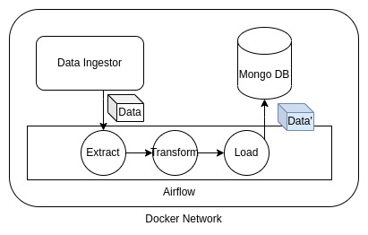

## Readme

This repo contains an example of Extract, Transform, and Load (ETL)
pipeline built upon Airflow and Python and deployed on top of Docker.

The system is composed of several containerized components:

1. Data Ingestor Web Service
   
   - Flask server that serves the data to be consumed by the pipeline

2. ETL Pipeline

   - Python library designed to for the ETL process
   - responsible for all operations regarding reading, cleaning, transforming
     and also uploading data to Mongo DB

> in order to enable easy access of Airflow to this library, it has been placed
> within the `dags` folder, so that it gets easily mounted on Airflow `PYTHONPATH`

3. Mongo DB

   - non-relational database responsible for the storage of the ETL pipeline results

4. Airflow

   - pipeline orchestrator
   - responsible for: 
     - downloading data from Data Ingestor Web Service
     - process the data through the ETL pipeline
     - upload data to Mongo DB



### Requirements

- Docker compatible OS (I used Debian GNU/Linux 10 buster, but all OS supporting Docker should be compatible)
- Docker version 24.0.2 (higher should work)
- Docker Compose version v2.2.3 (higher should work)
- GNU Make 4.3

> **Tip to avoid problems with Airflow deployment**: The default amount of memory available 
> for Docker on macOS is often not enough to get Airflow up and running. If 
> enough memory is not allocated, it might lead to the webserver continuously 
> restarting. You should allocate at least 4GB memory for the Docker Engine (ideally 8GB).

You can check if you have enough memory by running this command:

```shell
docker run --rm "debian:bullseye-slim" bash -c 'numfmt --to iec $(echo $(($(getconf _PHYS_PAGES) * $(getconf PAGE_SIZE))))'
```

> Tip: all commands are run from project root folder

### Pre-configuration

- Create folders to be mounted by Airflow

```shell
mkdir -p ./logs ./plugins ./config
```

- Create Airflow `.env` file

```shell
echo -e "AIRFLOW_UID=$(id -u)" > .env
```

- Build all needed containers

```shell
make build-containers
```

### How to use?

- Deploy the entire infrastructure

```shell
make deploy
```

- Wait until you can access http://localhost:8080 and can see the login page
  or until you see that the `airflow-webserver` prints the following log line 
  on the stdout:

```shell
Listening at: http://0.0.0.0:8080 (18)
```

- Keep this infrastructure up and running every time you want to either
  use it manually or run Integration Tests.

#### Using GUI mode

Using the pipeline through the Airflow GUI, requires some knowledge about
how to interact with the interface. Below, I give a list of minimal steps
to perform the ETL pipeline and check the results. However, if playing with 
the interface results in difficulties, please use the pipeline through the 
CLI mode explained in next chapter.

- Access http://localhost:8080 and login using credentials `USERNAME=airflow` 
  and `PASSWORD=airflow`
- Go to **Dags** section
- Search for `etl_pipeline` DAG and click on its name
- Run `etl_pipeline` (click on play button on screen top right)
- Wait until pipeline completes (progress vertical bar on left becomes green)
- Access Browse > Task Instances
- Click on the Task Id of your run and then click Logs to observe them
- Finally, check Mongo DB results by running:

```shell
make check-mongo-db
```

- You should see the following output:

```shell
Mongo contains expected data. IT PASSED.
```

The last command controls if data has been correctly ingested, transformed
and uploaded to the Mongo DB.

#### Using CLI mode

The ETL pipeline can be run using just CLI. In order to do so we are going 
to perform an entire Integration Test:

```shell
make integration-test
```

The integration test should end with the following message:

```shell
Mongo contains expected data. IT PASSED.
```

### How to test

#### Unit Testing

```shell
make unit-test-docker
```

- Should result in

```shell
======================== 12 passed, 4 warnings in 0.92s ========================
```

#### Integration Testing

- Requires infrastructure up and running (having previously run `make deploy`)

```shell
make integration-testing
```

- Should result in

```shell
Mongo contains expected data. IT PASSED.
```
